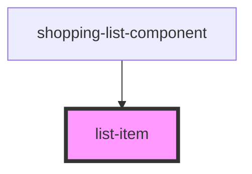

# my-component

<!-- Auto Generated Below -->

## Properties

| Property | Attribute | Description                  | Type     | Default     |
| -------- | --------- | ---------------------------- | -------- | ----------- |
| `name`   | `name`    | The name and id of this item | `string` | `undefined` |

## Events

| Event        | Description | Type                    |
| ------------ | ----------- | ----------------------- |
| `itemEdited` |             | `CustomEvent<ListItem>` |

## Dependencies

### Used by

 - [shopping-list-component](../shopping-list-component)

### Graph

----------------------------------------------

*Built with [StencilJS](https://stenciljs.com/)*
